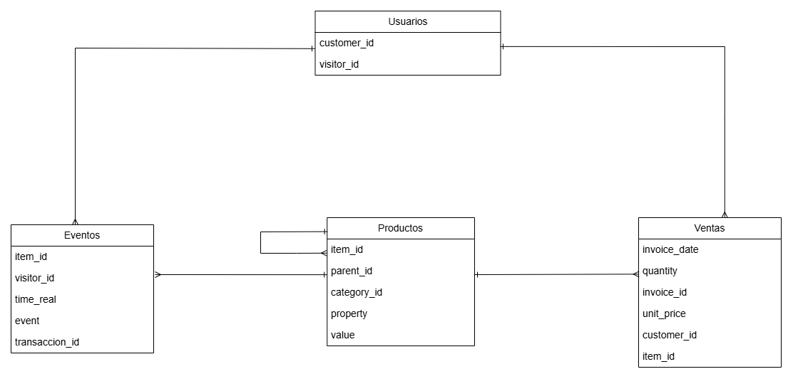

## proyecto-analisis-ecommerce
# Análisis de rentabilidad y conversión de usuarios de E-commerce

### Rol: Junior Data Analyst

## 📊 Dashboard Interactivo
🔗[Ver Dashboard en Looker Studio](https://datastudio.google.com/embed/u/0/reporting/4837de8f-0806-4f11-837f-1b2204bc17ce/page/MfQzF)

## Resumen:
En este proyecto analicé 3 años de datos de ventas y comportamiento de usuarios de un e-commerce global de artículos de regalo y estilo de vida, usando SQL para cruzar datos de transacciones y eventos web y evaluar rentabilidad, conversión y patrones de tráfico. Detecté una tasa de abandono de carrito del 64.4%, esta tasa estaba concentrada justo en el horario de mayor tráfico (21h, con solo 0.51% de conversión), mientras que el horario de las 17h combina alto tráfico y alta conversión de usuarios. También identifiqué una fuerte dependencia del mercado del Reino Unido y productos del catálogo que generan pérdidas en lugar de ganancias. Concluí con algunos insights accionables como: optimizar el checkout, reasignar el presupuesto de marketing hacia las franjas horarias de mayor conversión, limpiar el catálogo de productos no rentables y diversificar mercados podría reducir la fricción que hoy hace perder cerca de 2 de cada 3 intentos de compra, mejorando directamente el revenue y el retorno de inversión publicitaria.

## Fase de consulta: 
La empresa de e-commerce de productos de regalo y estilo de vida enfrenta una falta de visibilidad sobre la eficiencia real de su plataforma digital durante el último año. 
Actualmente, existen las siguientes incertidumbres:
- Posible pérdida de clientes potenciales durante el proceso de compra.
- Alto tráfico de clientes pero que no se refleja proporcionalmente en el revenue.
- No se identifican los productos con mayor y menor venta.
- No se puede determinar que productos necesitan un ajuste de precios, promoción o inversión en marketing.
- La empresa no conoce sus horas o días de mayor tráfico en su página web.
- La empresa no puede medir la conversión de las interacciones de los usuarios en ingresos generados.

Para eso se establecieron 3 principales preguntas a responder:
1. ¿Qué categoría de productos generan la rentabilidad más alta en el último año (2010-2011)?  
2. ¿Qué porcentaje de conversion rate existe por categoría y qué horario tiene el mayor tráfico pero bajo conversion rate? 
3. ¿Cuál es el LTV promedio de nuestros clientes y qué porcentaje del revenue depende de compradores recurrentes?

## Objetivo del análisis:
Analizar datos de ventas de productos de regalo y estilo de vida para identificar la rentabilidad global y aumentar la conversión de los usuarios.

## Proceso de análisis:
### 1. Preparación:
### Datos utilizados:
Para este análisis se usaron dos datasets abiertos del sitio web kaggle.com. El primer dataset corresponde al registro de ventas y el segundo a transacciones en el sitio web de dos diferentes ventas retail en la modalidad de e-commerce.

### 2. Información de los datasets:
### Organización de los datasets:
El primer dataset registró ventas retail online de una tienda localizada en Reino Unido de dos periodos (2009-2010 y 2010-2011) sobre productos de regalo y estilo de vida, entre los cuales están artículos para el hogar, estacionales y de regalo, que se han vendido en diferentes regiones. La tabla contiene filas con información como: invoice, stockcode, descripción, cantidad, fecha, precio, customer ID y país.



El segundo dataset registró las transacciones de ventas e-commerce a través de un sitio web recolectados en un período de 4.5 meses. La tabla contiene filas con información como: todos los eventos registrados de cada usuario que visitó el sitio web, otra de las propiedades sobre los productos de venta y las categorías de los mismos.

### Relación y estructura de las tablas:
El dataset que registra las ventas contiene una tabla llamada online_retail y el dataset que registra las transacciones de las ventas tiene 3 tablas, una de ellas se llama category_tree, events y propiedades.
Estos datasets se relacionan mediante el ID de la llaves (primaria y foránea), lo cual usé para unir las tablas.

### 3. Staging:
### Análisis exploratorio de los datasets en Excel/Power Query:
1. Estandarización de encabezados y verificación de tipos de datos.
2. Migración del procesamiento de datos a Power Query para optimizar la carga de memoria del conjunto de datos.
3. Transformación de la fecha mediante la fórmula:
                   #datetime(1970, 1, 1, 0, 0, 0) + #duration(0, 0, 0, [timestamp] / 1000)
   
### 4. Intermediate:

### Consulta de datos con SQL

1. Comencé por la creación de una tabla unificada de los dos períodos de ventas (2009-2010 / 2010-2011) y otra para las registrar las transacciones, categorías y propiedades.
   
```sql
CREATE TABLE online_retail_2009_2010 (
    invoice_id VARCHAR(50),
    item_id VARCHAR(50),   
    description VARCHAR(200),
    quantity INT,
    invoice_date TIMESTAMP,
    unit_price VARCHAR(50), 
    customer_id INT,
    country VARCHAR(100)
);
#######
----- Cambié las comas por puntos en los precios -----
UPDATE online_retail_2009_2010
SET unit_price = REPLACE(unit_price, ',', '.');
----- Convertí la columna de unit_price a tipo númerico real -----
ALTER TABLE online_retail_2009_2010
ALTER COLUMN unit_price TYPE NUMERIC(10,2) USING unit_price::NUMERIC;
#######
CREATE TABLE online_retail_2010_2011 (
    invoice_id VARCHAR(50),
    item_id VARCHAR(50),   
    description VARCHAR(200),
    quantity INT,
    invoice_date TIMESTAMP,
    unit_price VARCHAR(50), 
    customer_id INT,
    country VARCHAR(100)
);
#######
----- Cambié las comas por puntos en los precios -----
UPDATE online_retail_2010_2011
SET unit_price = REPLACE(unit_price, ',', '.');
----- Convertí la columna de unit_price a tipo númerico real -----
ALTER TABLE online_retail_2010_2011
ALTER COLUMN unit_price TYPE NUMERIC(10,2) USING unit_price::NUMERIC;
----- Uní las tablas de los dos períodos -----
CREATE TABLE ventas_totales AS
SELECT * FROM online_retail_2009_2010
UNION ALL
SELECT * FROM online_retail_2010_2011;
----- Confirmé que el número total de filas sea la sumatoria de las dos tablas-----
SELECT COUNT(*) AS total_filas_proyecto FROM ventas_totales;
#######
CREATE TABLE category_trans (
category_id VARCHAR(50),
parent_id VARCHAR(50)
);
#######
CREATE TABLE events_trans (
timestamp_raw VARCHAR(100),
visitor_id VARCHAR(50),
event_type VARCHAR(50),
item_id VARCHAR(50),
transaction_id VARCHAR(50),
time_real TIMESTAMP
);
#######
CREATE TABLE proper1_trans (
timestamp_raw VARCHAR(100),
item_id VARCHAR(50),
property_name VARCHAR(100),
property_value TEXT,
prop_time VARCHAR(100)
);
----- Transformé los datos correspondientes a el tiempo -----
SELECT * FROM proper1_trans LIMIT 10;
UPDATE proper1_trans
SET prop_time = REPLACE(prop_time, ',', '.');
#######
CREATE TABLE proper2_trans  (
timestamp_raw VARCHAR(100),
item_id VARCHAR(50),
property_name VARCHAR(100),
property_value TEXT,
prop_time VARCHAR(100)
);

----- Transformé los datos correspondientes a el tiempo -----

SELECT * FROM proper2_trans LIMIT 10;
UPDATE proper2_trans
SET prop_time = REPLACE(prop_time, ',', '.');

----- Uní las tablas de los dos períodos -----

CREATE TABLE properties_totales AS
SELECT * FROM proper1_trans 
UNION ALL
SELECT * FROM proper2_trans
----- Confirmé que el número total de filas sea la sumatoria de las dos tablas-----
SELECT COUNT(*) AS properties_total FROM properties_totales;
```
2. Transformé el formato de los archivos de Excel de .xsl a .csv. para introducir el conjunto de datos a SQL, sin embargo algunos contenían una gran cantidad de datos que no se pueden transformar a ese formato directamente, para esos archivos usé DAX studio para transformar algunos de ellos (eventos y propiedades).
   
3. Realicé las consultas que me permitirán encontrar las respuestas a las preguntas de análisis planteadas.

### ¿Que producto fue el más rentable en el último período (2010-2011)?
```sql
CREATE VIEW mas_rentabilidad AS
SELECT 
    item_id,
    SUM(unit_price * quantity) AS rentabilidad_total
FROM ventas_totales
WHERE invoice_date BETWEEN '2010-01-01' AND '2011-12-31'
GROUP BY item_id
ORDER BY rentabilidad_total DESC
LIMIT 10;
```
**Resultado:** 
El item_id 22423 registró la mayor rentabilidad con un valor de $327813.65 generados.

**Observación:**
El segundo item con mayor rentabilidad está registrado como DOT y no con un valor numérico, por lo tanto se debe definir si es un código de algún item u otro concepto.

### ¿Que producto fue el menor rentable en el último período (2010-2011)?
```sql
CREATE VIEW menor_rentabilidad AS
SELECT 
    item_id,
SUM(unit_price * quantity) AS rentabilidad_total
FROM ventas_totales
WHERE invoice_date BETWEEN '2010-01-01' AND '2011-12-31'
GROUP BY item_id
ORDER BY rentabilidad_total ASC
LIMIT 10;
```
**Resultado:** 
El item registrado como AMAZONFEE representa una rentabilidad negativa de -$260763.58

**Observación:**
El segundo item con menos rentabilidad está registrado como “B” y no con un valor numérico, por lo tanto se debe definir si es un código de algún item u otro concepto.

### % Crecimiento mensual (MoM) Nov 2011 - Dic 2011
Este negocio de tipo ecommerce se dedica a la venta de artículos de estilo de vida y regalos, por lo tanto analicé el mes de noviembre de 2011 con respecto a diciembre de 2011, ya que este último es a nivel global un mes donde se realizan muchas celebraciones con regalos.

```sql
CREATE VIEW nov11dic11_mom AS
SELECT 
EXTRACT(MONTH FROM invoice_date),
SUM(unit_price*quantity) AS rentabilidad_mensual
FROM ventas_totales
#######
SELECT *,
LAG(rentabilidad_mensual) OVER (ORDER BY extract) AS rentabilidad_anterior,
((rentabilidad_mensual - LAG(rentabilidad_mensual) OVER (ORDER BY extract))*100.0)/LAG(rentabilidad_mensual) OVER (ORDER BY extract) AS growth_mensual
FROM nov11dic11_mom
```
**Resultado:**
El mes de diciembre de 2011 registró un decrecimiento de -70.33% en su rentabilidad mensual a comparación con noviembre de 2011. Es decir, las ventas en el mes de diciembre bajaron con respecto a el mes anterior (noviembre).

- **Noviembre 2011:** $1,461,756.25
- **Diciembre 2011:** $433,686.01

### % Crecimiento anual (YoY) Dic 2010 - Dic 2011
```sql
CREATE VIEW dic10dic11_yoy AS 
SELECT 
EXTRACT (YEAR FROM invoice_date),
SUM(unit_price*quantity) AS rentabilidad_anual
FROM ventas_totales
WHERE (invoice_date BETWEEN '2010-12-01' AND '2010-12-31') OR (invoice_date BETWEEN '2011-12-01' AND '2011-12-31' )
GROUP BY EXTRACT (YEAR FROM invoice_date)
#######
SELECT *,
LAG(rentabilidad_anual) OVER (ORDER BY extract) AS rentanual_anterior,
((rentabilidad_anual - LAG(rentabilidad_anual) OVER (ORDER BY extract))*100.0)/LAG(rentabilidad_anual) OVER (ORDER BY extract) AS growth_anual
FROM dic10dic11_yoy
```
**Resultado:**
El mes de diciembre de 2011 registró un decrecimiento de -61.49% en su rentabilidad mensual a comparación con diciembre de 2010. Es decir, las ventas en el mes de diciembre 2011 bajaron con respecto a diciembre del año anterior (2010).

### ¿Cuál es el producto estrella en cada uno de los países donde se opera?
```sql
CREATE VIEW top_producto_por_pais AS
WITH ranking_productos AS (
SELECT 
country,
item_id,
SUM(quantity) AS unidades_vendidas,
ROW_NUMBER() OVER (PARTITION BY country ORDER BY SUM(quantity) DESC) AS puesto
FROM ventas_totales
GROUP BY country, item_id
)
SELECT 
country,
item_id,
unidades_vendidas
FROM ranking_productos
WHERE puesto = 1
ORDER BY unidades_vendidas DESC;
```
**Resultado:**
El Reino Unido fue el país que registró el número más alto de unidades vendidas, con un total de 99,760 unidades con el item #84077. El segundo producto que registra más ventas es el item #37410 con un total de 25,164 unidades en Dinamarca. Por lo tanto se puede concluir que el producto más vendido no necesariamente es el más vendido a nivel global y que Reino Unido registrá la zona geográfica donde más se comercializa.

### ¿Cuál fue el producto que más se vendió y en qué país?
```sql
CREATE VIEW producto_mas_vendido AS
SELECT
country,
item_id,
SUM(quantity) AS unidades_vendidas_global
FROM ventas_totales
GROUP BY country, item_id
ORDER BY unidades_vendidas_global DESC 
LIMIT 1;
```
**Resultado:**
El producto que más se vendió fue el item #84077 con un total de 99,760 unidades vendidas en el Reino Unido.

### ¿Qué día de la semana se vende más y que día se vende menos?
```sql
CREATE VIEW ventas_por_dia_semana AS
SELECT 
EXTRACT(ISODOW FROM invoice_date) AS numero_dia,
CASE 
WHEN EXTRACT(ISODOW FROM invoice_date) = 1 THEN 'Lunes'
WHEN EXTRACT(ISODOW FROM invoice_date) = 2 THEN 'Martes'
WHEN EXTRACT(ISODOW FROM invoice_date) = 3 THEN 'Miércoles'
WHEN EXTRACT(ISODOW FROM invoice_date) = 4 THEN 'Jueves'
WHEN EXTRACT(ISODOW FROM invoice_date) = 5 THEN 'Viernes'
WHEN EXTRACT(ISODOW FROM invoice_date) = 6 THEN 'Sábado'
WHEN EXTRACT(ISODOW FROM invoice_date) = 7 THEN 'Domingo'
END AS nombre_dia,
SUM(quantity) AS unidades_vendidas,
SUM(unit_price * quantity) AS ingresos_totales
FROM ventas_totales
GROUP BY numero_dia
ORDER BY numero_dia ASC;
```
**Resultado:**
El día que registró más ventas fue el jueves con un total de ingresos de $3,995,032.01, con 2,307.505 unidades vendidas. Por el contrario, el día con menos ventas es el sábado con $9,803.05 con 5033 unidades vendidas. 

### ¿Qué franjas horarias registran más ingresos y menos ingresos?
```sql
CREATE VIEW ventas_por_hora AS
SELECT
EXTRACT(HOUR FROM invoice_date) AS hora,
SUM(unit_price*quantity) AS rentabilidad_horaria
FROM ventas_totales
GROUP BY hora
ORDER BY rentabilidad_horaria DESC; 
```
**Resultado:**
La hora que registró mayor venta fue la de 12 p.m., es decir, el mediodía con un ingreso de $2,728,333.85, por el contrario la hora con menos ingreso que se registró fue a las 6 a.m. con un ingreso de -$497.35, esto puede ser debido a cancelaciones o devoluciones que se registraron al día siguiente de haberlas hecho por el usuario.

### Revenue total
```sql
CREATE VIEW revenue_total AS
SELECT
SUM(unit_price*quantity) AS ingresos_totales
FROM ventas_totales
WHERE quantity > 0
```
**Resultado:**
Los ingresos totales de este negocio ecommerce entre los años 2009-2011 es de $20,814,291.98.

### Revenue del último año 2011
```sql
CREATE VIEW revenue_2011 AS
SELECT 
SUM(unit_price*quantity) AS ingreso_total
FROM ventas_totales
WHERE invoice_date>= '2011-01-01' AND invoice_date <= '2011-12-31'
AND quantity > 0;
```
**Resultado:**
Los ingresos totales del año 2011 de este negocio ecommerce es de $9,820,832.28.

### Revenue por producto - Top 10 de producto con mayor y menor revenue
```sql
CREATE VIEW revenue_por_producto AS
SELECT
item_id,
SUM(unit_price*quantity) AS revenue_total
FROM ventas_totales
WHERE quantity > 0
 AND item_id NOT IN ('B', 'DOT', 'POST', 'M', 'BANK CHARGES', 'AMAZONFEE', 'CRUK')
GROUP BY item_id
ORDER BY revenue_total DESC
LIMIT 10; 
SELECT
*
FROM revenue_por_producto
WHERE item_id <> 'B'
AND revenue_total > 0
ORDER BY revenue_total ASC
LIMIT 10;
```
**Resultado:**
El producto más rentable es el item #22423 con una rentabilidad generada de $344,563.25; y el menos rentable es el item #35930 con un valor de $0.38. Los demás productos que conforman el ranking de 10 productos con mayor y menor revenue se colocan en el dashboard de Looker Studio.

### Profit estimado consolidado del período 2009-2011
```sql
CREATE VIEW profit_total AS
SELECT
SUM(unit_price*quantity) * 0.40 AS profit_estimado
FROM ventas_totales
```
**Resultado:**
El profit estimado de este negocio ecommerce es de $7,714,900.2200

### Profit estimado por año
```sql
CREATE VIEW profit_estimado_anual AS
SELECT
EXTRACT(YEAR FROM invoice_date) AS anio,
SUM(unit_price * quantity) AS revenue_total,
SUM(unit_price*quantity)*0.40 AS profit_total
FROM ventas_totales
WHERE invoice_date >= '2009-01-01' AND invoice_date<= '2011-12-31'
AND quantity > 0
GROUP BY EXTRACT(YEAR FROM invoice_date)
ORDER BY anio ASC;
```
**Resultado:**
Se encontró que el profit estimado ha tenido un crecimiento exponencial del 2009 a 2010 sin embargo en el 2011 decreció no tan significativamente, con los siguientes valores:

- **Año 2009:** 330,274.3040
- **Año 2010:** 4,067,109.5760
- **Año 2011:** 3,928,332.9120

### Profit estimado por producto - Top 10 de producto con mayor y menor profit
```sql
CREATE VIEW profit_por_producto AS
SELECT
item_id,
SUM(unit_price*quantity) * 0.40 AS profit_estimado
FROM ventas_totales
WHERE quantity > 0
 AND item_id NOT IN ('B', 'DOT', 'POST', 'M', 'BANK CHARGES', 'AMAZONFEE', 'CRUK')
GROUP BY item_id
ORDER BY profit_estimado DESC
LIMIT 10; 
SELECT * FROM profit_por_producto 
WHERE profit_estimado > 0
ORDER BY profit_estimado ASC
LIMIT 10; 
```

**Resultado:**
El producto con mayor profit estimado es el item #22423 con una rentabilidad generada de $137,825.300; y el producto con menor profit estimado es el item #35930 con un valor de $0.1520. Los demás productos que conforman el ranking de 10 productos con mayor y menor profit estimado se colocan en el dashboard de Looker Studio.

### Clientes únicos
```sql
CREATE VIEW cliente_unico AS
SELECT
COUNT(DISTINCT customer_id) AS clientes_unicos
FROM ventas_totales
```
**Resultado:**
Existe 5942 clientes únicos en la base de datos que registaron al menos una compra.

### AOV
```sql
CREATE VIEW aov_customer AS
SELECT
SUM(unit_price*quantity)/COUNT(DISTINCT invoice_id) AS ticket_promedio
FROM ventas_totales
```
**Resultado:**
En promedio cada compra hace un cliente se realiza por el valor de $485.79.

### Frecuencia de compra
```sql
CREATE VIEW frecuencia_de_compra AS
SELECT
ROUND(COUNT(DISTINCT invoice_id)::numeric / COUNT(DISTINCT customer_id), 2) AS frecuencia_promedio 
FROM ventas_totales
WHERE quantity > 0
AND customer_id IS NOT NULL 
AND item_id NOT IN ('B', 'DOT', 'POST', 'M', 'BANK CHARGES', 'AMAZONFEE', 'CRUK');
```
**Resultado:**
El promedio de compra de un cliente es de 6.25, es decir, un cliente en 3 años de operación ha realizado entre 6 y 7 compras.

### Life time value promedio (Valor de Vida del Cliente) 
```sql
CREATE VIEW ltv_promedio_cliente AS
SELECT 
a.ticket_promedio,
f.frecuencia_promedio,
ROUND(a.ticket_promedio * f.frecuencia_promedio, 2) AS ltv_promedio
FROM aov_customer a
CROSS JOIN frecuencia_de_compra f; -- Usamos CROSS JOIN porque ambas vistas devuelven una sola fila global
```
**Resultado:**
El valor de vida de un cliente para este negocio de ecommerce es de $3036.19 a lo largo del tiempo.

### % Conversion rate 
```sql
CREATE VIEW conversion_rate_global AS
WITH metricas_conversion AS (
SELECT
COUNT(DISTINCT visitor_id) AS total_visitantes,
COUNT(DISTINCT CASE WHEN transaction_id IS NOT NULL AND transaction_id <> '[null]' THEN visitor_id END) AS visitantes_compradores
FROM events_trans
)
SELECT
total_visitantes,
visitantes_compradores,
ROUND((visitantes_compradores::numeric / total_visitantes) * 100,2) AS conversion_rate_porcentaje
FROM metricas_conversion;
```
**Resultado:**
La tasa de conversión de usuario que visitan la página web y terminan en compra es de 0.99%.

### % Conversión rate por producto
```sql
CREATE VIEW cr_por_producto_real AS
WITH metricas_eventos AS (
SELECT 
item_id,
COUNT(DISTINCT visitor_id) AS visitantes_totales,
COUNT(DISTINCT CASE WHEN transaction_id IS NOT NULL AND transaction_id <> '[null]' THEN visitor_id END) AS compradores_totales
FROM events_trans
GROUP BY item_id
),
nombres_productos AS (
SELECT DISTINCT item_id, description 
FROM ventas_totales
)
SELECT 
m.item_id,
COALESCE(n.description, 'Producto de catálogo web') AS description, 
m.visitantes_totales,
m.compradores_totales,
ROUND((m.compradores_totales::numeric / m.visitantes_totales) * 100, 2) AS conversion_rate_porcentaje
FROM metricas_eventos m
LEFT JOIN nombres_productos n ON m.item_id = n.item_id
WHERE m.compradores_totales > 0 
ORDER BY conversion_rate_porcentaje DESC;
```
**Resultado:**
La tasa de conversión de usuario por producto varía entre el 10% -100% en un total de 86 productos. 

### Cart abandonment rate
```sql
CREATE VIEW tasa_abandono AS
WITH totales_clicks AS (
SELECT 
COUNT(*) FILTER (WHERE event_type = 'addtocart') AS carritos_totales,
COUNT(*) FILTER (WHERE event_type = 'transaction') AS compras_totales
FROM events_trans
)
SELECT 
carritos_totales,
compras_totales,
(carritos_totales - compras_totales) AS carritos_abandonados,
ROUND((1 - (compras_totales::numeric / carritos_totales)) * 100, 2) AS cart_abandonment_rate_global
FROM totales_clicks;
#####
CREATE VIEW tasa_abandono_carrito AS
WITH metricas_globales AS (
SELECT 
COUNT(*) FILTER (WHERE event_type = 'addtocart') AS carritos,
COUNT(*) FILTER (WHERE event_type = 'transaction') AS compras
FROM events_trans
),
metricas_por_item AS (
SELECT 
item_id,
COUNT(*) FILTER (WHERE event_type = 'addtocart') AS carritos_creados,
COUNT(*) FILTER (WHERE event_type = 'transaction') AS compras_exitosas
FROM events_trans
GROUP BY item_id
),
nombres_productos AS (
SELECT DISTINCT item_id, description FROM ventas_totales
)
SELECT 
'GLOBAL' AS item_id,
'--- TOTAL EMBUDO NEGOCIO (ACCIONES) ---' AS description,
carritos AS carritos_creados,
compras AS compras_exitosas,
ROUND((1 - (compras::numeric / carritos)) * 100, 2) AS cart_abandonment_rate_porcentaje
FROM metricas_globales
UNION ALL
SELECT 
m.item_id,
COALESCE(n.description, 'Producto de catálogo web') AS description,
m.carritos_creados,
m.compras_exitosas,
CASE 
WHEN m.carritos_creados = 0 THEN 0
ELSE ROUND((1 - (m.compras_exitosas::numeric / m.carritos_creados)) * 100, 2)
END AS cart_abandonment_rate_porcentaje
FROM metricas_por_item m
LEFT JOIN nombres_productos n ON m.item_id = n.item_id
WHERE m.carritos_creados > 0
ORDER BY carritos_creados DESC;
```
**Resultado:**

El dataset de ventas (`ventas_totales`) cubre 3 años completos (2009-2011), mientras que el dataset de comportamiento web (`eventos`) cubre solo un período de 4.5 meses. Por eso las métricas de tráfico, conversión y abandono de carrito reflejan una ventana de tiempo mucho más corta que las de revenue y rentabilidad, y no deben compararse directamente en escala.

La tasa de abandono de carrito de compra de este negocio de ecommerce es de 64.40%, es decir, que de cada 100 intentos de compra 64 no se llevan a término. Durante el período de 4.5 meses registrado en el dataset de eventos, se abandonaron 161 carritos de un total de 250 que fueron creados, y solo 89 carritos terminaron en compra.

### Horario crítico
```sql
CREATE VIEW mayortrafico_pocaconversion AS
WITH metricas_por_hora AS (
SELECT 
EXTRACT(HOUR FROM time_real) AS hora,
COUNT(*) FILTER (WHERE event_type = 'view') AS vistas,
COUNT(*) FILTER (WHERE event_type = 'transaction') AS compras
FROM events_trans
GROUP BY EXTRACT(HOUR FROM time_real)
)
SELECT 
hora,
vistas,
compras,
ROUND((compras::numeric / vistas) * 100, 2) AS conversion_rate
FROM metricas_por_hora
ORDER BY vistas DESC
```
**Resultado:**
La franja horaria de mayor tráfico y menor conversión de usuarios a las 21 p.m. con un total de 785 vistas en la página web y a su vez solo un 0.51% de usuarios que terminan una compra. Por otra parte, se encontró que la franja horaria de mayor tráfico y mayor conversión a las 17 p.m. con un total de 14 compras y 836 visitas en la página.

### Purchase-to-view rate
```sql
CREATE VIEW purchase_to_view_productos AS
WITH datos_filtrados AS (
SELECT 
item_id,
COUNT(*) FILTER (WHERE event_type = 'view') AS vistas,
COUNT(*) FILTER (WHERE event_type = 'transaction') AS compras
FROM events_trans
GROUP BY item_id
HAVING COUNT(*) FILTER (WHERE event_type = 'view') > 5
),
nombres_productos AS (
SELECT DISTINCT item_id, description 
FROM ventas_totales
)
SELECT 
df.item_id,
COALESCE(np.description, 'Producto sin ventas registradas') AS description,
df.vistas,
df.compras,
ROUND((df.compras::numeric / df.vistas) * 100, 2) AS purchase_to_view_ratio
FROM datos_filtrados df
LEFT JOIN nombres_productos np ON df.item_id = np.item_id
ORDER BY purchase_to_view_ratio DESC;
```
**Resultado:**
El item #281211 fue el producto que recibió más vistas y logró que más usuarios compraran el producto, con un 28.57% de purchase-to-view rate, donde se obtuvo que recibió 7 visitas y 2 de ellas finalizaron en compra. 

## Insights principales:

### 1. Eficiencia horaria

El tráfico de usuarios aumenta significativamente durante las horas de la tarde entre las 15:00 y 21:00 horas sin embargo es infeciente durante la madrugada (potencialmente bots, rastreadores o usuarios sin intención de compra).  Se sugiere reconsiderar la estrategia y presupuesto de pauta digital durante el resto de las horas que no presenta un tráfico representativo (durante la madrugada y la mañana) para maximizar el retorno de inversión.

### 2. Fricción en el checkout

Se encontró que existe una tasa de abandono del 64.4%, lo que nos indica dos cosas: la estrategia de marketing está generando tráfico e intención de compra a los usuarios; y que el proceso se detiene al momento de pagar. Se sugiere realizar una revisión UX/UI en el proceso de pago e investigar si los posibles factores de barrera que detienen al usuario al comprar como costos de envío sorpresa, pasarelas de pago que fallan, formulario de envío no intuitivo o muy largo, registro de cupones no válidos u otros. 

### 3. Dependencia de Mercado

El negocio tiene ventas predominantes en Europa pero especialmente dependencia del mercado dentro del Reino Unido. Esto podría representar un riesgo si existen cambios en su economía y/o regulaciones en esa región. Se recomienda perfilar al consumidor de UK, sus preferencias y recomendaciones sobre los productos, para replicar las estrategias de marketing en otras parte de Europa, además de empezar a estudiar el mercado en otras regiones para introducirse en ellos.


### 4. Limpieza de catálogo

El item #22423 es el producto que registró mayor profit estimado, sin embargo también se encontraron productos que registraron pérdidas, esto podría ser causado como un costo de almacenamiento o logística por encima de su valor de retorno. No todos los productos que se venden generan ingresos. Se recomienda una limpieza de catálogo, ajustar precios, descontinuar productos con menor rentabilidad, aplicar estrategias de marketing en temporadas altas como podría ser de octubre a diciembre (cuando la gente busca decorar sus casas con temáticas festivas), crear combos o promociones cruzadas para rotar productos menos vendidos con los productos estrella.

## Conclusión:

Este negocio de e-commerce sobre artículos de estilo de vida y regalo tiene una ineficiencia en su tasa de conversión de usuarios sin embargo tiene una alta eficiencia operativa que podría optimizarse con una limpieza de catálogo y priorizando la ventas de los items con más rentabilidad en los horarios de mayor tráfico en la página web; además de buscar estrategias de marketing para expandir sus ventas a otras regiones y en fechas o temporadas especiales cuando sus clientes buscan mejorar sus espacios con productos de temporada. 


